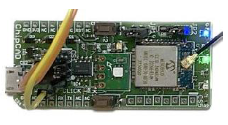

# WLR089-click ChipCAD training demo
This repo contains a simplified demo from Microchip official LORAWAN stack repo.
https://github.com/MicrochipTech/ATSAMR34_LORAWAN_H3

Harmony 3 configurator does not work with this project. The original project is based on Harmony 3 framework, then modified manually to add sercom3 and make it compatible with new compiler and WLR089.

Target board is WLR089-click from ChipCAD Ltd. (https://www.chipcad.hu/)


1. Download and install [MPLAB® X IDE v6.20 tested](https://www.microchip.com/en-us/development-tools-tools-and-software/mplab-x-ide)
2. Download and install [MPLAB XC32 Compiler v4.35 tested](https://www.microchip.com/en-us/development-tools-tools-and-software/mplab-xc-compilers)
3. Clone this repo
4. Connect HW to PICkit 5 to ICSP connector(CS5)
5. Build and Program the device from MPLAB X IDE under **Production -> Make and Program Device**
6. Open a terminal software
7. Connect to the virtual com port with a serial communication program
   1.  115200-8-N-1 
8. Observe the output on the terminal

Demo application uses DemoJoin paramteres. These can be modified in configuration.h (Header Files->config->default->configuration.h lines: 227-229(OTAA))

First LoRaWAN activation needs serial port commands in application menu. 
After first successfull LoRaWAN join activation PDS save parameters and after HW reset reloads it, no need to rejoin.
This can be interrupted by any character sent to the serial port within 5 seconds after the HW reset.

There are 2 options to send uplink message.
1. In application menu	
2. Pushing K1 button
	
Uplink contains the LED states and the measured temperature in Celsius and Fahrenheit also.
First byte:
-	0x30	Blue and Green off
-	0x31	Blue on and Green off
-	0x32	Blue off and Green on
-	0x33	Blue and Green on
	
LED states can be modified thru downlink message to the PORT #1.
-	0x30	Blue and Green off
-	0x31	Blue on and Green off
-	0x32	Blue off and Green on
-	0x33	Blue and Green on
	
Demo support LW1.0.4 and LW1.0.3, 1.0.2 and 1.0.1 combatible network servers. Need to be select in configuration.h line: # 241-245  	

/* To join with NS supporting LW1.0.4 */
#define APP_JOIN_NONCE_TYPE                     JOIN_NONCE_INCREMENTAL

/* To join with NS supporting LW1.0.3, LW1.0.2, LW1.0.1 */
//#define APP_JOIN_NONCE_TYPE                     JOIN_NONCE_RANDOM


```
Last reset cause: External Reset

Microchip LoRaWAN Stack - MLS v2.0.0

Init - Successful


 1. Demo application
 2. Enable/disable Certification mode

Enter your choice:
```

> Note #1: Checkout the [SAM R34 MLS Getting Started Guide](https://www.microchip.com/en-us/product/ATSAMR34J18#document-table) to get details on the application flow.

</br>

> Note #2: If using ATECC608 as crypto companion for the Join process, checkout the following resources to get more details :
> - [Develop with the SAM R34 LoRa SiP and WLR089U0 Module with Microchip LoRaWAN stack on TTI join server](https://github.com/MicrochipTech/atsamr34_ecc608a_tti)
